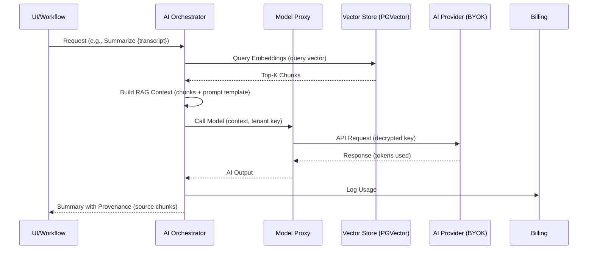

# BusinessOS AI Platform Design

## Overview
The AI Platform provides tenant-controlled AI capabilities, including BYOK (Bring Your Own Key) for model access, vector search with RAG (Retrieval-Augmented Generation), and agentic workflows. Integrated across modules (e.g., CRM lead scoring, support reply drafting), it uses Node.js/Express for the orchestrator, PostgreSQL with PGVector for embeddings, and secure key management. Designed for Oracle Free Tier: No external vector DBs; leverage PostgreSQL extensions for cost efficiency. Focus on privacy (tenant keys never shared) and cost controls (token metering).

## Core Components

1. **Model Proxy (BYOK)**
   - **Purpose:** Routes AI requests to providers (OpenAI, Anthropic, Grok, etc.) using tenant-specific API keys, with fallback and routing logic.
   - **Features:**
     - Tenant config: Provider, API key (encrypted), model family (chat/text/embeddings), fallback model, cost thresholds.
     - Request shaping: Add system prompts, track tokens for billing.
     - Routing: Select model based on task (e.g., embeddings -> text-embedding-ada-002).
     - Cost Controls: Pre-check quotas; reject if exceeded.
   - **Implementation:**
     - Express.js service with routes (/ai/chat, /ai/embed, /ai/completions).
     - Key Storage: Encrypted in PostgreSQL (using pgcrypto or node-crypto); access via tenant context.
     - Adapters: Modular (e.g., OpenAI SDK wrapper); axios for HTTP calls.
     - Security: Keys decrypted per-request in memory; never logged.
     - Fallback: If primary fails/quota hit, route to platform default (e.g., free Grok API if available).
   - **Database Snippet:**
     ```sql
     CREATE TABLE ai.model_configs (
         tenant_id UUID NOT NULL,
         provider VARCHAR(50) NOT NULL, -- e.g., 'openai', 'anthropic'
         api_key_encrypted TEXT NOT NULL,
         model_chat VARCHAR(100) DEFAULT 'gpt-4o-mini',
         model_embedding VARCHAR(100) DEFAULT 'text-embedding-3-small',
         fallback_provider VARCHAR(50),
         max_tokens_per_month INTEGER DEFAULT 100000,
         -- RLS policy
     );
     ```

2. **Embedding Generation & Vector Store**
   - **Purpose:** Generate and store document embeddings for semantic search/RAG, integrated with Knowledge Base and modules.
   - **Features:**
     - Auto-ingestion: On document upload (e.g., KB article, contract PDF), chunk text (500-token chunks), generate embeddings via proxy.
     - Index Maintenance: Auto-refresh on updates; chunking rules (overlap, metadata).
     - Search: Hybrid (vector + keyword) queries.
   - **Implementation:**
     - PGVector Extension: `CREATE EXTENSION vector;` in PostgreSQL.
     - Table: vectors (id, tenant_id, content_chunk TEXT, embedding VECTOR(1536), metadata JSONB).
     - Generation: Cron job or event-triggered (BullMQ) calls embedding endpoint.
     - Query: Use cosine similarity (e.g., `<->` operator) for top-k results.
     - Chunking: Simple JS splitter (recursive character split with overlap).
   - **Database Snippet:**
     ```sql
     CREATE TABLE ai.vectors (
         id UUID PRIMARY KEY,
         tenant_id UUID NOT NULL,
         source_id UUID NOT NULL, -- e.g., KB article ID
         content_chunk TEXT NOT NULL,
         embedding VECTOR(1536), -- Dimension for OpenAI embeddings
         metadata JSONB, -- e.g., {chunk_index: 1, keywords: []}
         created_at TIMESTAMP DEFAULT NOW()
     );

     CREATE INDEX ON ai.vectors USING ivfflat (embedding vector_cosine_ops) WITH (lists = 100);
     -- RLS: USING (tenant_id = current_setting('app.current_tenant_id')::UUID)
     ```

3. **RAG Templates & Reusable Prompts**
   - **Purpose:** Pre-built prompts for modules (e.g., "Summarize this ticket" for Support).
   - **Features:**
     - Templates: Stored JSON (prompt text, variables like {user_input}, model params).
     - Variables: Dynamic insertion (e.g., from workflow data).
     - Per-module: CRM (lead scoring), Accounting (anomaly detection).
   - **Implementation:**
     - PostgreSQL table: ai.prompt_templates (tenant_id, module, name, json_def).
     - Usage: Workflow/AI nodes load template, inject vars, call proxy.
     - Examples:
       - RAG Prompt: "Using context: {retrieved_docs}, answer: {query}"
       - Lead Scoring: "Score this lead 1-10 based on {firmographics}: {lead_data}"

4. **Agent Flows**
   - **Purpose:** Multi-step AI agents for complex tasks (e.g., contract review workflow).
   - **Features:**
     - Chain-of-Thought (CoT): Prompt engineering for reasoning steps.
     - Constraints: Define tools/actions (e.g., query DB, call API); human-in-loop for approvals (e.g., risky outputs like financial advice).
     - Integration: Embed in workflows (agent as a node type).
   - **Implementation:**
     - LangChain.js or custom: Agent executor with tools (e.g., vector search tool, DB query tool).
     - Human-in-Loop: Pause execution, notify via Event Bus (email/UI alert), resume on approval.
     - Storage: Extend workflow executions for agent traces (steps, decisions).
     - Constraints: Validate outputs against rules (e.g., regex for PII); reject if violated.

**Mermaid Diagram: RAG Data Flow**


**Mermaid Diagram: Agent Flow Example**
```mermaid
graph TD
    Start[User Query: Review Contract]
    A[Agent Step 1: Extract Clauses<br/>(Embed & RAG)]
    B[Step 2: CoT Reasoning<br/>(Risk Assessment)]
    C{Constraint Check<br/>(PII/Compliance)}
    D[Human-in-Loop<br/>(Approve Output)]
    E[Step 3: Generate Tasks<br/>(e.g., 90-day Review)]
    End[Output: Tasks Created]

    Start --> A
    A --> B
    B --> C
    C -->|Pass| E
    C -->|Fail/Risky| D
    D --> E
    E --> End

    style D fill:#FFD700
```

## Integration & Governance
- **Module Ties:** APIs called from services/workflows (e.g., CRM opportunity scoring).
- **Provenance:** All outputs include metadata (model used, sources, tokens).
- **Metering:** Proxy logs to Billing; alerts on 80% quota.
- **Security:** Requests scoped to tenant; no cross-tenant data in prompts.
- **Testing:** Mock providers; unit tests for RAG accuracy (e.g., 90% clause recognition).

## Scalability & Free Tier Fit
- Embeddings batched (queue 100 docs); queries <100ms with indexes.
- Proxy stateless; cache common embeddings in Redis.
- MVP: Support 50 connectors' AI needs for 100 pilots.

## Risks & Mitigations
- Vendor Lock: Abstract proxy for easy swaps.
- Cost Overruns: Hard limits; monitor via cron.
- Accuracy: Tune chunking/prompts; human feedback loops.
- Privacy: Encrypt keys; audit prompt injections.

This design realizes spec section 6.4, enabling AI-augmented operations with tenant control.