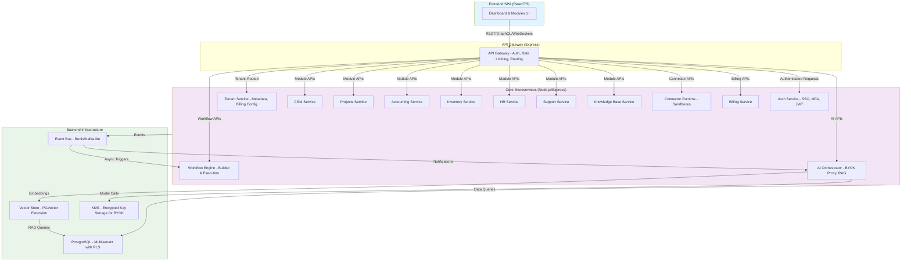

# BusinessOS High-Level Architecture

## Overview
BusinessOS is a multi-tenant SaaS platform built with Node.js/Express backend, PostgreSQL database, React/TypeScript frontend, deployed on Oracle Free Tier.

## Mermaid Diagram: System Components

## Key Interactions
- **API Flow**: Frontend calls hit Gateway, authenticated via Auth Service, routed to tenant-specific instances.
- **Event-Driven**: Services publish to Event Bus for workflows and AI triggers.
- **Data Layer**: Shared PostgreSQL with tenant isolation via Row-Level Security (RLS).
- **AI Layer**: BYOK keys stored in KMS, proxied through AI service to providers like OpenAI/Anthropic.

This diagram captures the microservices architecture from the spec, optimized for free tier constraints (e.g., in-memory Redis for events).