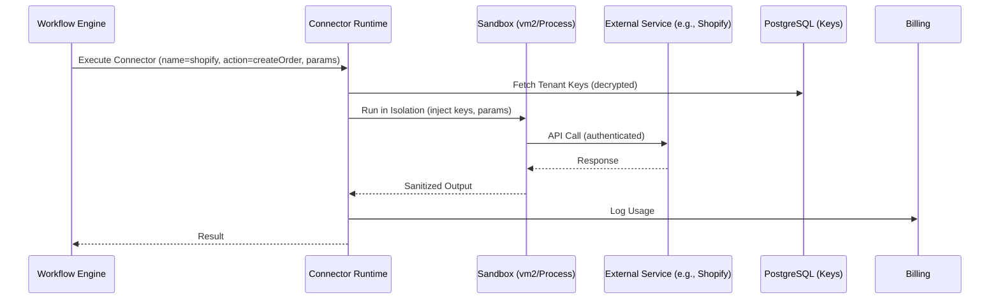

# BusinessOS Connector Ecosystem & Marketplace Design

## Overview
The Connector Ecosystem enables integration with 150+ external services (e.g., Shopify, Stripe, Slack), starting with 50 for MVP. Connectors are pluggable adapters for workflows, AI, and modules. The design includes an SDK for developers to build custom connectors, a secure runtime for execution, and a marketplace for discovery/sharing. Implemented in Node.js for consistency, with PostgreSQL storage and Redis for caching. Optimized for Oracle Free Tier: Lightweight, no heavy containers; use process isolation.

Key Goals: Scale via partners, n8n compatibility for node definitions, secure execution (no direct API key exposure).

## 1. Connector SDK
**Purpose:** Toolkit for developers/integrators to create connectors (e.g., # published as KPI).

**Features:**
- Standardized interface: Auth (OAuth/API key), actions (e.g., get_orders, send_notification), triggers (webhooks/polling).
- n8n Compatibility: Export as n8n nodes for import.
- Testing: Local simulator for auth flows, mock APIs.
- Publishing: Package as NPM module; metadata for marketplace.

**Implementation:**
- NPM Package: `@businessos/connector-sdk` with TypeScript types.
- Core Classes:
  - `Connector`: Base class with `authenticate()`, `executeAction(action, params)`.
  - Auth Handlers: OAuth2, Basic, API Key.
  - Examples: Shopify connector (actions: create_order, trigger: new_order_webhook).
- CLI Tool: `bos-connector init shopify --template=commerce` to scaffold.
- Validation: Schema for actions (JSON Schema); linting for security (no eval).

**Example Code Snippet (SDK Usage):**
```typescript
import { Connector, OAuth2Auth } from '@businessos/connector-sdk';

class ShopifyConnector extends Connector {
  constructor() {
    super({
      name: 'shopify',
      version: '1.0.0',
      auth: new OAuth2Auth({
        clientId: 'config.client_id',
        scopes: ['read_orders', 'write_products']
      }),
      actions: [
        {
          name: 'createOrder',
          description: 'Create a new order',
          params: { line_items: { type: 'array' } },
          execute: async (params) => {
            const response = await this.api.post('/orders', params);
            return response.data;
          }
        }
      ],
      triggers: [
        {
          name: 'newOrder',
          description: 'Trigger on new order',
          webhook: '/webhooks/orders/create'
        }
      ]
    });
  }
}

export default new ShopifyConnector();
```

**Documentation:** Auto-generated from code; templates for common services (CRM, e-commerce).

## 2. Connector Runtime
**Purpose:** Securely execute connectors in workflows without exposing tenant data/keys.

**Features:**
- Sandboxing: Isolate execution to prevent malicious code (e.g., infinite loops, data leaks).
- Auth Management: Tenant stores keys in DB (encrypted); injected per-run.
- Execution: Async calls from workflow nodes; retries, timeouts.
- Monitoring: Log calls for auditing/billing (e.g., API usage metering).

**Implementation:**
- Node.js Workers: Use `vm2` for sandboxed JS execution (limit globals, timeout 30s).
- For Complex: Isolated child processes (child_process.fork) with IPC; no Docker on free tier.
- Registry: Load connectors dynamically (NPM install on-demand, cached).
- Integration: Workflow node calls runtime API (/connectors/{name}/execute), passes tenant context.
- Security: No network access outside API calls; validate outputs (e.g., schema enforcement).
- Free Tier Fit: In-memory caching; limit concurrent runs (e.g., 5 per tenant).

**Mermaid Diagram: Runtime Execution**


## 3. Marketplace
**Purpose:** Discover, install, and publish connectors/apps/workflows.

**Features:**
- Catalog: Search/browse by category (e.g., e-commerce, payments), ratings, installs.
- Publishing: Developers submit via SDK CLI; approval workflow for security review.
- Installation: One-click install to tenant (adds to registry, prompts for auth setup).
- Monetization: Free/open + paid (future); partner ecosystem for 150+ by month 12.
- Governance: Versioning, deprecation notices, audit for compliance.

**Implementation:**
- Backend: Express routes in Connectors Service (/marketplace/search, /marketplace/install/{id}).
- Storage: PostgreSQL table for metadata (id, name, author, description, npm_package, category, version, installs_count).
- Frontend: React marketplace page (integrated in dashboard); search with PostgreSQL full-text.
- Publishing Flow: GitHub-like: Submit PR to central repo; auto-build/test; approved -> NPM publish + DB entry.
- Installation: `npm install {package}` in runtime (or pre-install common ones); tenant config stores installed list.

**Database Snippet:**
```sql
CREATE TABLE connectors.marketplace (
    id UUID PRIMARY KEY DEFAULT gen_random_uuid(),
    tenant_id UUID, -- NULL for global, tenant-specific for private
    name VARCHAR(255) NOT NULL,
    description TEXT,
    author VARCHAR(255),
    npm_package VARCHAR(255) NOT NULL,
    category VARCHAR(100), -- e.g., 'crm', 'payments'
    version VARCHAR(20),
    installs INTEGER DEFAULT 0,
    approved BOOLEAN DEFAULT FALSE,
    created_at TIMESTAMPTZ DEFAULT NOW()
);
-- RLS: Allow global reads; tenant writes for private
```

## Integration with Platform
- **Workflows:** Connector nodes load from runtime (e.g., "Shopify: Create Order").
- **AI:** Connectors for data ingestion (e.g., fetch emails for RAG).
- **Modules:** Direct calls (e.g., Plaid for bank feeds in Accounting).
- **Events:** Webhook endpoints registered in Gateway.
- **MVP:** Bootstrap with 50 connectors (Stripe, Shopify, Google Workspace, etc.) via open-source/n8n ports.

## Scalability & Free Tier Fit
- Dynamic loading: Cache installed connectors in Redis.
- Limits: 10 concurrent executions; queue excess.
- Growth: CDN for marketplace assets; partner API for submissions.

## Risks & Mitigations
- Security: Sandbox audits; scan for vulnerabilities (npm audit).
- Compatibility: Strict SDK schema; backward compat versions.
- Adoption: Seed with popular connectors; docs/tutorials.
- Overhead: Optimize sandboxes (reuse pools); monitor RAM.

This design supports spec sections 6.5 (Connector SDK + Marketplace) and goals for rapid integration scaling.