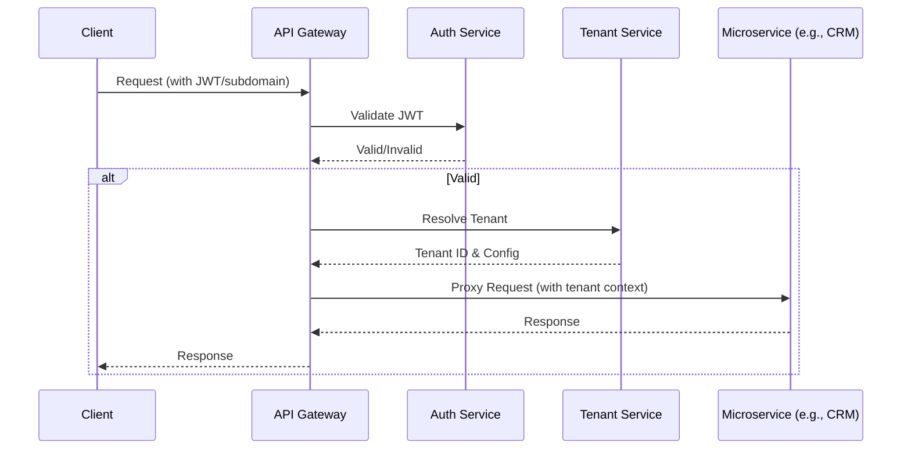

# BusinessOS Core Platform Services Design

## Overview
The core platform services provide foundational capabilities for authentication, tenant management, API routing, and billing. These are implemented as lightweight Node.js/Express microservices, orchestrated via the API Gateway, and integrated with PostgreSQL for persistence. Design emphasizes security, modularity, and efficiency for Oracle Free Tier constraints.

## 1. API Gateway
**Purpose:** Single entry point for all client requests, handling cross-cutting concerns like authentication, rate limiting, and routing to backend services.

**Key Features:**
- Authentication enforcement (JWT validation, tenant resolution).
- Rate limiting per tenant/IP (e.g., 1000 req/min for MVP).
- Request logging and metrics (Prometheus-compatible for future monitoring).
- CORS, helmet for security headers.
- Routing to microservices (internal URLs or direct invocation).

**Implementation:**
- Express.js server with middleware stack:
  - `helmet()` for security.
  - `cors()` for frontend access.
  - `express-rate-limit` for throttling.
  - Custom auth middleware: Verify JWT, resolve tenant from subdomain/header, set `req.tenantId`.
  - `http-proxy-middleware` to proxy to services (e.g., /crm/* -> CRM service).
- Deployment: Runs on port 3000; services on internal ports (e.g., 3001 for Auth).

**Mermaid Diagram: Gateway Flow**


**Acceptance Criteria:**
- Requests without valid JWT return 401.
- Rate limit exceeded returns 429.
- Tenant context propagated to all downstream services.

## 2. Auth Service
**Purpose:** Manages user authentication, sessions, and authorization basics (full RBAC in security layer).

**Key Features:**
- Email/password login with bcrypt hashing.
- SSO: SAML/OIDC via Passport.js strategies.
- MFA: TOTP (e.g., Google Authenticator) with speakeasy.
- JWT issuance (tenant-scoped, short-lived access + refresh tokens).
- User provisioning (SCIM for enterprise).

**Implementation:**
- Express.js app with PostgreSQL for users table (tenant_id, email, hashed_password, mfa_secret).
- Routes: /login, /sso/callback, /mfa/verify, /refresh.
- JWT: jsonwebtoken lib, signed with tenant-specific keys (rotated periodically).
- Sessions: Redis for refresh token storage (in-memory for free tier).
- Integration: Exposes /validate endpoint for Gateway.

**Database Snippet:**
```sql
CREATE TABLE auth.users (
    id UUID PRIMARY KEY,
    tenant_id UUID NOT NULL,
    email VARCHAR(255) UNIQUE NOT NULL,
    hashed_password VARCHAR(255),
    mfa_enabled BOOLEAN DEFAULT FALSE,
    mfa_secret VARCHAR(255),
    -- RLS policy as per multi-tenancy
);
```

**Acceptance Criteria:**
- Successful login returns JWT with user/tenant claims.
- SSO flow redirects and issues JWT.
- MFA required for sensitive actions (e.g., billing changes).

## 3. Tenant Service
**Purpose:** Handles tenant lifecycle, metadata, and configuration.

**Key Features:**
- Onboarding: Create tenant, provision initial admin user.
- Metadata management: Name, region, plan, custom domains.
- Config: SSO settings, connector keys, model providers (for BYOK).
- Region selection for data residency (maps to DB cluster in future).

**Implementation:**
- Express.js with CRUD routes (/tenants/:id, /tenants/onboard).
- PostgreSQL table: tenants (id, name, region, plan_tier, created_at).
- Integration: Called by Gateway for resolution; updates trigger events to Billing.
- Validation: Ensure unique subdomain, validate region (e.g., 'us', 'eu').

**Database Snippet:**
```sql
CREATE TABLE platform.tenants (
    id UUID PRIMARY KEY DEFAULT gen_random_uuid(),
    name VARCHAR(255) NOT NULL,
    subdomain VARCHAR(255) UNIQUE,
    region VARCHAR(10) DEFAULT 'global',
    plan_tier VARCHAR(50) DEFAULT 'free',
    -- BYOK config: model_provider JSONB
    created_at TIMESTAMP DEFAULT NOW()
);
```

**Acceptance Criteria:**
- Onboarding creates tenant and user in <5s.
- Config updates propagate to cache (Redis) for fast access.

## 4. Billing Service
**Purpose:** Manages subscriptions, usage metering, and invoicing.

**Key Features:**
- Subscription tiers (e.g., Basic: $49/mo, Pro: $199/mo with more AI tokens).
- Metering: Track AI tokens, workflow runs, connector calls (via event bus).
- Invoicing: Generate PDFs, email delivery.
- Integration: Stripe for payments (webhooks for events).

**Implementation:**
- Express.js with Stripe SDK.
- PostgreSQL for usage logs (tenant_id, resource_type, quantity, timestamp).
- Middleware in Gateway/services to log usage (e.g., post-AI call: increment tokens).
- Routes: /billing/subscribe, /billing/usage, /billing/invoice.
- Cron job (node-cron) for monthly metering aggregation and Stripe charges.
- Free Tier: Soft limits enforced (e.g., 10k tokens/mo), upgrade prompts.

**Database Snippet:**
```sql
CREATE TABLE billing.usage (
    id UUID PRIMARY KEY,
    tenant_id UUID NOT NULL,
    resource_type VARCHAR(50), -- e.g., 'ai_tokens', 'workflow_runs'
    quantity INTEGER NOT NULL,
    period_start DATE,
    period_end DATE
);
```

**Acceptance Criteria:**
- Usage accurately metered and billed via Stripe.
- Exceed limits triggers alerts/workflow pauses.
- Invoices generated with line items for modules/AI.

## Integration Notes
- All services use shared PostgreSQL with RLS.
- Communication: Internal HTTP (no external deps for free tier).
- Monitoring: Basic logging to files; future ELK stack.
- Scalability: Stateless design; horizontal scaling via PM2 clustering.

This design aligns with spec sections 6.1 (Core Platform) and enables modular extension for MVP goals.