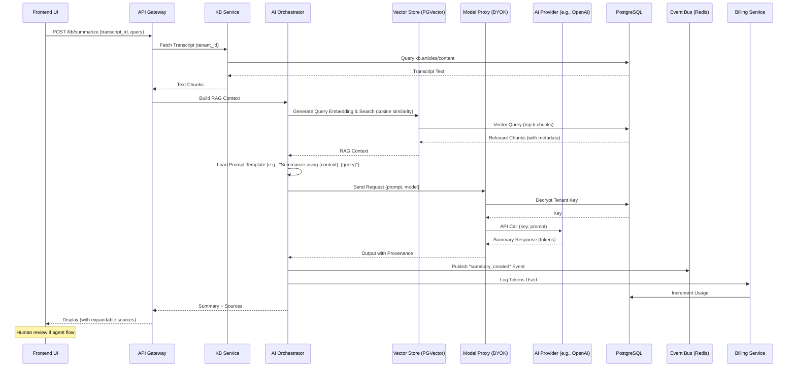
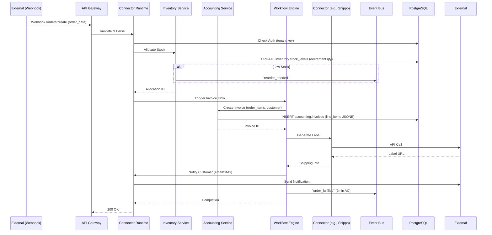
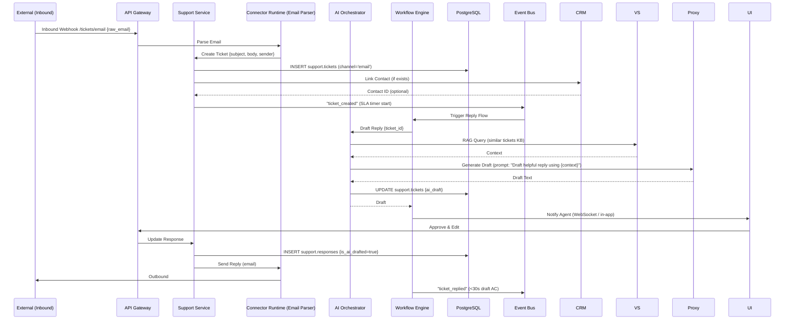

# BusinessOS Data Flow Diagrams for Key Use Cases

## Overview
These diagrams illustrate end-to-end data flows for representative use cases from the spec (sections 5 & 7.2). Using Mermaid sequence diagrams to show interactions between frontend, services, DB, external systems, and AI/workflows. Focus on async/event-driven patterns for performance. Diagrams assume tenant context is propagated throughout.

## 1. AI-Assisted Summarization (Spec 7.2 Example)
User requests summary of a meeting transcript in the Knowledge Base or Support module.



**Key Notes:** <60s end-to-end; provenance for audit; event triggers workflows (e.g., email summary).

## 2. Sales Use Case: Enrich Inbound Leads (Spec 5)
Inbound lead via form/email -> Enrich with firmographics -> Auto-assign rep -> Start multichannel workflow.

```mermaid
sequenceDiagram
    participant UI as CRM UI / Form
    participant AG as API Gateway
    participant CRM as CRM Service
    participant Connectors as Connector Runtime
    participant EB as Event Bus
    participant Workflow as Workflow Engine
    participant DB as PostgreSQL

    UI->>AG: POST /crm/leads {email, name, source}
    AG->>CRM: Create Lead Record
    CRM->>DB: INSERT crm.contacts (dedupe check)
    DB-->>CRM: Contact ID
    CRM->>Connectors: Enrich (e.g., Clearbit API)
    Connectors->>External: API Call (tenant key)
    External-->>Connectors: Firmographics (company, revenue)
    Connectors-->>CRM: Enriched Data
    CRM->>DB: UPDATE crm.contacts {firmographics}
    CRM->>EB: Publish "lead_enriched" Event
    EB->>Workflow: Trigger Assignment Flow
    Workflow->>DB: Load Workflow JSON
    Workflow->>CRM: Query Reps (round-robin or score-based)
    CRM-->>Workflow: Assigned Rep ID
    Workflow->>Connectors: Send Email (e.g., SendGrid)
    Connectors->>External: Send Outreach
    Workflow->>EB: Publish "sequence_started"
    Workflow-->>CRM: Workflow ID
    CRM-->>AG: Lead Created + Assigned
    AG-->>UI: Success Toast; Update List (<60s AC)
```

**Key Notes:** Enrichment within 60s; workflow handles follow-ups; activity logged in timeline.

## 3. Commerce Use Case: Shopify Order Flow (Spec 5)
Shopify order -> Inventory allocation -> Accounting invoice -> Shipping -> Notification.



**Key Notes:** Full flow <2min; inventory sync prevents oversell; events for reporting.

## 4. Support Use Case: Ticket Creation & AI Draft (Spec 5)
Incoming email -> Ticket -> AI-draft reply -> Approval -> Send.



**Key Notes:** 80% drafts <30s; human approval for quality; SLA enforcement via workflow.

## Additional Use Cases
- **Finance Reconciliation:** Stripe webhook -> Match invoice -> Flag discrepancy -> Workflow alert (98% accuracy).
- **HR Candidate Flow:** LinkedIn connector -> Create record -> Schedule interview workflow -> Offer letter.
- **Legal Contract:** PDF upload -> AI extract clauses -> Vector store -> 90-day task creation.

These flows demonstrate embedded automation and AI, with events ensuring loose coupling. Full implementation uses the defined architecture for durability and scalability.