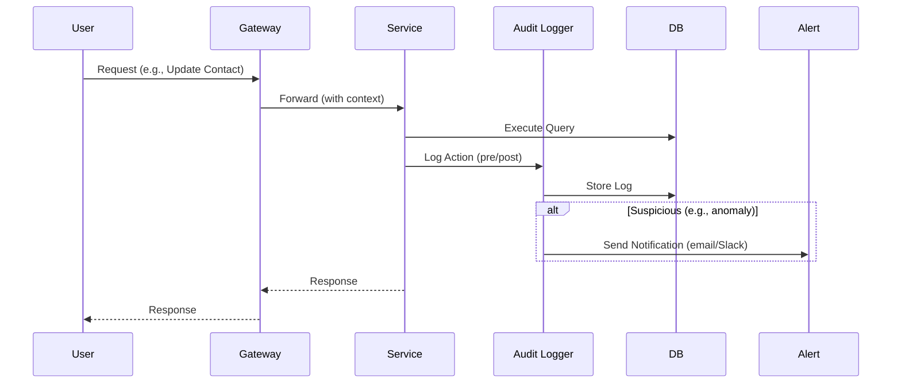

# BusinessOS Security & Admin Features Design

## Overview
Security and admin features ensure enterprise-grade governance, aligning with spec section 6.5 (data retention, KMS, access logs, SIEM). Design incorporates RBAC/ABAC for authorization, comprehensive auditing, data residency controls, and admin tools. Implemented across services with Node.js middleware, PostgreSQL for logs/config, and integrations for compliance (SOC2 roadmap). Free Tier Fit: Lightweight logging (file/DB hybrid), no heavy SIEM initially.

## 1. Authentication & Authorization
**RBAC (Role-Based Access Control):**
- Roles: Global (tenant_admin, user, viewer); module-specific (crm_manager, finance_auditor).
- Permissions: Granular (e.g., read:contacts, write:invoices).
- Implementation: JWT claims include roles; Express middleware checks (e.g., `requireRole('tenant_admin')`).
- DB: `platform.roles` (id, name, permissions JSONB); `platform.user_roles` (user_id, role_id).

**ABAC (Attribute-Based Access Control):**
- For sensitive data (e.g., HR salaries, financials): Attributes like data_sensitivity (low/medium/high), user_department.
- Policies: e.g., "If user.role = finance_auditor AND data.sensitivity <= medium, allow read".
- Implementation: Custom middleware evaluates attributes from JWT/DB; use Open Policy Agent (OPA) lite for complex rules (in-memory for free tier).
- Extension: Integrate with RLS in PostgreSQL (e.g., policy: USING (sensitivity_level <= get_user_max_sensitivity())).

**Example Policy Evaluation:**
```javascript
// Middleware
function abacCheck(req, res, next) {
  const userSensitivity = getUserAttribute(req.user.id, 'max_sensitivity');
  const resourceSensitivity = getResourceAttribute(req.params.id, 'sensitivity');
  if (userSensitivity >= resourceSensitivity) {
    next();
  } else {
    res.status(403).send('Access denied');
  }
}
```

## 2. Audit Logs & Monitoring
**Purpose:** Track all actions for compliance (audit trails, SOC2).

**Features:**
- Log levels: All CRUD, auth events, workflow runs, AI calls, connector executions.
- Retention: Configurable (default 1 year); auto-purge via cron.
- Export: Tenant admins download CSV/JSON; SIEM integration (future: Splunk webhook).
- Alerts: Real-time for suspicious (e.g., >10 failed logins, high-privilege access).

**Implementation:**
- Centralized Logger: Winston.js with transports (DB, file rotation).
- Middleware: In Gateway/services, log {tenant_id, user_id, action, resource, timestamp, ip, outcome}.
- DB Table:
  ```sql
  CREATE TABLE platform.audit_logs (
      id UUID PRIMARY KEY DEFAULT gen_random_uuid(),
      tenant_id UUID NOT NULL,
      user_id UUID REFERENCES platform.users(id),
      action VARCHAR(100) NOT NULL, -- e.g., 'create_invoice', 'ai_query'
      resource_type VARCHAR(50),
      resource_id UUID,
      details JSONB, -- e.g., {old_value: ..., new_value: ...}
      ip_address INET,
      user_agent TEXT,
      outcome VARCHAR(20) DEFAULT 'success', -- success, failure
      created_at TIMESTAMPTZ DEFAULT NOW()
  );
  CREATE INDEX idx_audit_logs_tenant_created ON platform.audit_logs (tenant_id, created_at);
  -- RLS: Tenants read own logs; platform admins read all
  ```
- Queries: Tenant-specific views (e.g., SELECT * WHERE tenant_id = current_tenant).

**Mermaid Diagram: Audit Flow**


## 3. Data Residency & Governance
**Features:**
- Region Selection: Tenants choose (e.g., US, EU, APAC) on onboarding; routes to regional DBs/clusters.
- Retention Policies: Per-tenant/module (e.g., delete inactive contacts after 2 years).
- Export Tools: Full/partial data dumps (pg_dump filtered by tenant_id).
- Data Masking: For non-owners (e.g., hash PII in queries).

**Implementation:**
- Tenant Config: `platform.tenants.region` (maps to DB endpoint, e.g., 'eu-west' -> EU Oracle instance).
- Multi-Region: Future: Read replicas per region; writes to primary with replication.
- Retention: Node-cron jobs query config, DELETE with WHERE clauses (e.g., created_at < NOW() - INTERVAL '2 years').
- Masking: App-level (e.g., redact emails in responses unless authorized); DB functions for hashing.
- Compliance: GDPR/SOC2 - Consent flags in users table; data processing agreements in tenant metadata.

## 4. Key Management Service (KMS) for BYOK
**Purpose:** Secure storage for tenant API keys (AI, connectors).

**Features:**
- Encryption: At-rest (pgcrypto), in-transit (TLS).
- Access: Decrypt only in memory per-request; rotate keys.
- Enterprise BYOK: Integrate with external KMS (e.g., AWS KMS via connector).

**Implementation:**
- DB: Encrypted columns (e.g., `UPDATE model_configs SET api_key_encrypted = pgp_sym_encrypt('key', tenant_key)`).
- Decryption: In AI/Connector services, use tenant master key (derived from setup passphrase).
- Audit: Log decryption attempts.

## 5. Admin Features
**Tenant Admin Dashboard:**
- Settings: Users, SSO/SCIM setup, connector keys, region/billing config, audit export.
- Tools: Data export, retention policy config, alert rules.
- Implementation: React pages calling Tenant Service APIs; RBAC enforced.

**Platform Admin (BusinessOS Team):**
- Global oversight: Monitor tenants, approve marketplace items, view aggregated audits.
- SIEM: Webhook to external (future); basic dashboards with SQL views.

## Integration & Best Practices
- **Enforcement:** All services use shared auth/audit middleware.
- **Testing:** Security scans (e.g., npm audit), penetration tests for RLS/ABAC.
- **Compliance Roadmap:** SOC2 Type 1: Implement logs/retention; Type 2: Third-party audit.
- **Incidents:** Alert on anomalies (e.g., via simple threshold rules in cron).

## Risks & Mitigations
- Over-Logging: Sample non-critical events; compress old logs.
- ABAC Complexity: Start with RBAC, layer ABAC for sensitive modules.
- Residency: Single region for MVP; plan multi-region migration.
- Key Exposure: Zero-trust: Keys never in logs/config files.

This design provides robust security aligned with target personas (IT/Security Officer KPIs: audit readiness, low incidents).