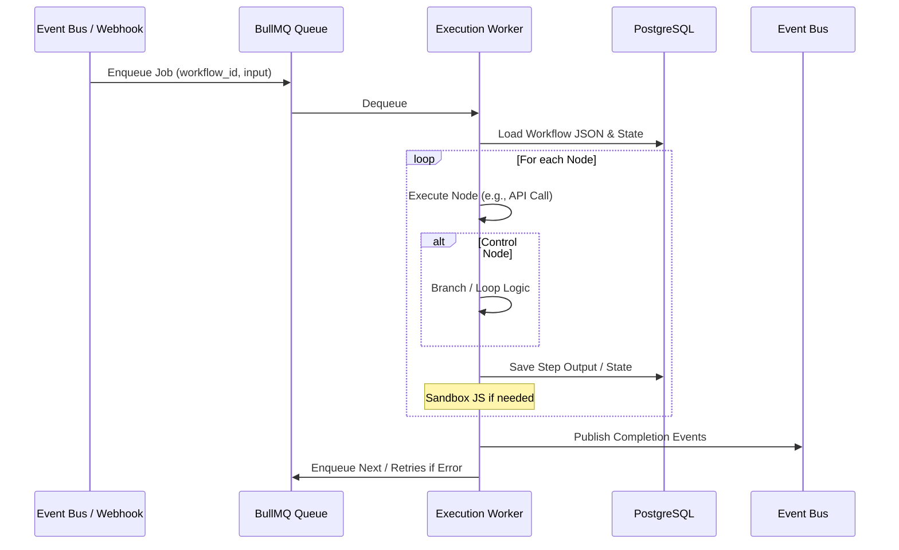

# BusinessOS Workflow Engine Design

## Overview
The Workflow Engine is an embedded, n8n-compatible automation system integrated across all modules. It enables visual creation of workflows for business processes, with deep ties to CRM, AI, connectors, and events. Designed for Node.js/Express, it uses PostgreSQL for storage and Redis for queuing to fit Oracle Free Tier limits. Key goals: Low-latency execution, durability for long-running flows, governance for compliance.

## Core Components
1. **Visual Builder (Frontend Integration)**
   - React/TS component library (e.g., React Flow or custom drag-drop) for canvas-based design.
   - Nodes palette: Drag built-in nodes; connect via edges.
   - Features: Immediate test-run (simulate execution), dry-run (validate without side-effects), step-level debug (breakpoint simulation), versioning (git-like diffs on JSON).
   - Storage: Serialize workflow as JSON (nodes, edges, config) to DB.
   - UI Behaviors: Real-time validation (e.g., required inputs), auto-save, export/import n8n format.

2. **Workflow Storage & Management**
   - PostgreSQL tables for workflows, versions, executions.
   - Schema: workflows (id, tenant_id, name, json_def, status: draft/active/archived, version).
   - API: Express routes in Workflow Service (/workflows/create, /workflows/{id}/publish, /workflows/{id}/test).

3. **Execution Engine**
   - **Queue System:** BullMQ (Redis-based) for durable job queuing; supports retries, priorities, delays.
   - **Worker Pool:** Node.js workers (PM2 clustered) that poll queues, execute node-by-node.
   - **State Management:** Durable state in PostgreSQL (execution_id, step, input/output, status); Redis for in-flight state (TTL for short flows).
   - Execution Flow: Trigger (event/webhook) -> Queue job -> Worker deserializes JSON -> Run nodes sequentially/parallel -> Persist outputs -> Trigger next (e.g., event bus).
   - n8n Compatibility: JSON schema mirrors n8n; import/export via adapters.

4. **Built-in Nodes**
   - **Control Flow:** Condition (if/else on data), Parallel (fork joins), Loop (iterate array), Wait/Delay (timer), Try/Catch (error handling).
   - **Data Transform:** JS Code (sandboxed vm2 execution), Merge/Split data.
   - **Integration:** Webhook (Express endpoint), API Call (axios with auth), Run Serverless (invoke Lambda-like functions in isolated workers).
   - **Module-Specific:** CRM Create Contact, AI Generate Text, Connector (e.g., Shopify Order).
   - Implementation: Each node as a JS class/module (e.g., class ConditionNode { async execute(input) { ... } }); Registry loads dynamically.

**Mermaid Diagram: Node Types**
```mermaid
graph LR
    Start[Start Trigger<br/>(Event/Webhook)]
    CF[Control Flow Nodes<br/>- Condition<br/>- Parallel<br/>- Loop<br/>- Wait<br/>- Try/Catch]
    DT[Data Transform<br/>- JS Code<br/>- Merge]
    INT[Integration Nodes<br/>- API Call<br/>- Webhook<br/>- Serverless<br/>- Module (CRM/AI)]
    End[End Node<br/>(Output/Success/Error)]

    Start --> CF
    Start --> DT
    Start --> INT
    CF --> DT
    CF --> INT
    DT --> CF
    DT --> INT
    INT --> CF
    INT --> End
    CF --> End
    DT --> End

    style Start fill:#90EE90
    style End fill:#FFB6C1
```

**Mermaid Diagram: Execution Flow**


5. **Governance & Auditing**
   - **Permissions:** RBAC via Auth Service (roles: creator, approver, executor); only approved workflows run in production.
   - **Approval Gates:** Draft -> Pending -> Active; approvers review via UI (diff view).
   - **Audit Trail:** Log all executions to DB (execution_id, tenant_id, steps, duration, errors); exportable for SOC2.
   - **Limits:** Per-tenant quotas (e.g., 100 active workflows, 10k runs/mo) enforced by Billing Service.
   - **Error Handling:** Dead-letter queue for failures; notifications via email/Slack connector.

## Integration with Platform
- **Triggers:** Event Bus (Kafka-lite/Redis PubSub) for module events (e.g., new lead -> CRM workflow).
- **Outputs:** Publish to Event Bus for downstream (e.g., workflow end -> update Accounting).
- **AI/Connectors:** Nodes call AI Orchestrator or Connector Runtime via internal APIs.
- **Testing:** Unit tests for nodes; integration tests simulate full flows.

## Scalability & Free Tier Fit
- Stateless workers scale horizontally (multiple PM2 instances).
- Redis in-memory (fits 1GB RAM); DB queries optimized with indexes on tenant_id/execution_id.
- MVP: Support 100 pilots with <1s avg execution (async for long flows).

## Risks & Mitigations
- Complexity: Modular node design; start with core nodes, extend via SDK.
- Durability: BullMQ handles crashes; state snapshots every 5 steps.
- Security: Sandbox all JS/executable code (vm2 limits globals); validate inputs.

This design fulfills spec section 6.3, enabling embedded automation rivaling n8n while integrating seamlessly with BusinessOS modules.